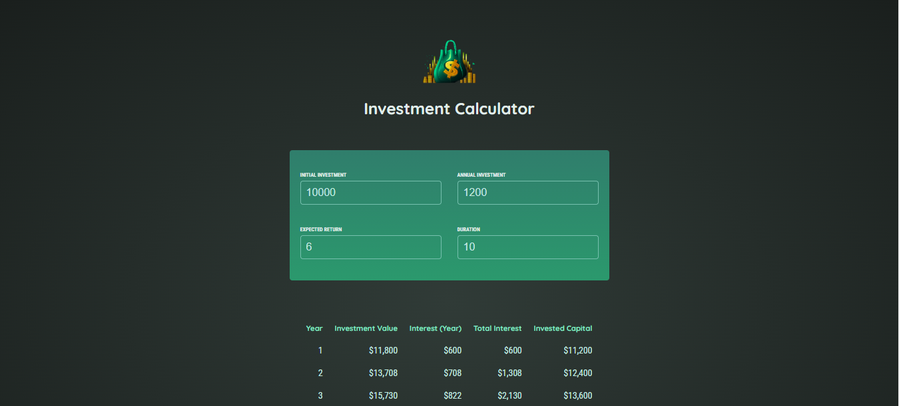

# React Investment 💹

**React Investment** est un projet réalisé dans le cadre de ma formation en React. Il s'agit d'une application qui simule la croissance d'un investissement basé sur des données saisies par l'utilisateur, avec un tableau détaillé des résultats.

## 🚀 Fonctionnalités

- **Saisie des données d'investissement** :
  - **Initial Investment** : Somme de départ.
  - **Annual Investment** : Montant ajouté chaque année.
  - **Expected Return** : Taux de rendement annuel attendu (en pourcentage).
  - **Duration** : Durée totale de l'investissement (en années).
- **Calcul automatique** :
  - Affichage de la valeur de l'investissement par année.
  - Calcul des intérêts gagnés chaque année, du total des intérêts, et du capital investi.
- **Tableau des résultats** : Résumé clair et structuré pour chaque année.

## 🛠️ Technologies utilisées

- **React** : Pour construire l'interface utilisateur et gérer l'état.
- **CSS** : Pour le design et la mise en forme.

 ## 🎨 Aperçu 🖼️
Voici la captures d'écran de l'application :  


## 📦 Installation et utilisation

1. **Cloner le dépôt** :
   ```bash
   git clone https://github.com/Martialdepaul/react-investment.git
   ```
2. **Accéder au dossier** :
   ```bash
   cd react-investment
   ```
3. **Installer les dépendances** :
   ```bash
   npm install
   ```
4. **Démarrer l'application** :
   ```bash
   npm start
   ```

## 🎯 Exemple d'utilisation

### Données saisies dans les champs :
- **Initial Investment** : `10,000 $`
- **Annual Investment** : `1,200 $`
- **Expected Return** : `6%`
- **Duration** : `10 ans`

### Résultat généré :
| Year | Investment Value | Interest (Year) | Total Interest | Invested Capital |
|------|------------------|-----------------|----------------|------------------|
| 1    | $11,800          | $600           | $600           | $11,200          |
| 2    | $13,708          | $708           | $1,308         | $12,400          |
| 3    | $15,730          | $822           | $2,130         | $13,600          |
| 4    | $17,874          | $944           | $3,074         | $14,800          |
| 5    | $20,147          | $1,072         | $4,147         | $16,000          |
| 6    | $22,556          | $1,209         | $5,356         | $17,200          |
| 7    | $25,109          | $1,353         | $6,709         | $18,400          |
| 8    | $27,815          | $1,507         | $8,215         | $19,600          |
| 9    | $30,684          | $1,669         | $9,884         | $20,800          |
| 10   | $33,725          | $1,841         | $11,725        | $22,000          |

## 📂 Structure du projet

```plaintext
src/
├── components/
│   ├── InputForm.jsx  // Formulaire pour saisir les données
│   ├── ResultTable.jsx // Composant pour afficher le tableau des résultats
├── App.js             // Composant principal de l'application
├── index.css          // Feuille de style CSS
```

## 🛠️ Objectifs pédagogiques

Ce projet m'a permis de :
- Maîtriser la gestion des **états** et des **props** dans React.
- Comprendre le processus de rendu conditionnel.
- Renforcer mes compétences en **CSS** pour créer des interfaces claires et fonctionnelles.

## 📄 Licence

Ce projet est libre d'utilisation et modifiable.

---

Développé dans le cadre de ma formation React avec ❤️ par [Martial De-Paul](https://github.com/Martialdepaul).
```

### Points à ajouter éventuellement :
1. **Capture d'écran ou GIF** de l'application pour illustrer son fonctionnement.
2. **Lien vers une démo** si vous avez déployé le projet en ligne (par exemple, sur Vercel ou Netlify). 

Si vous avez d'autres éléments à inclure, faites-le-moi savoir ! 😊
